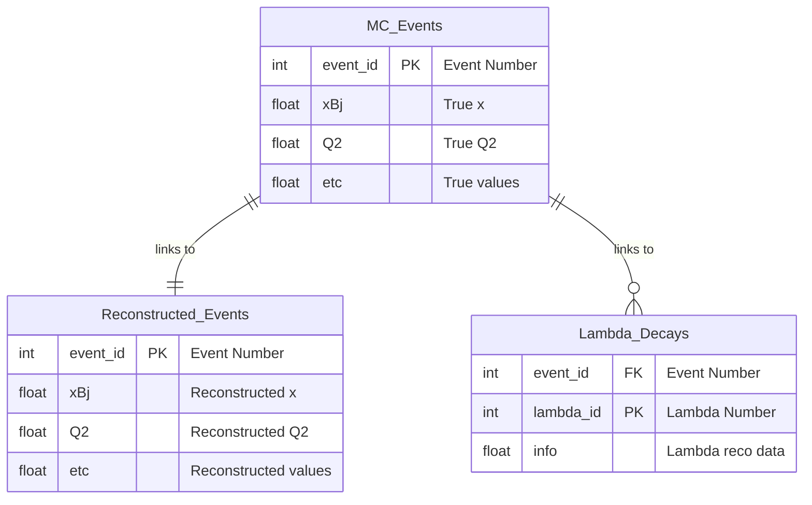

# CSV Data

We provide the relevant part `*.EDM4EIC.root` data converted to the CSV format 

- The CVS files are located in the same place as `*.edm4eic.root` files
- File names correspond to each other. E.g. `k_lambda_5x41_5000evt_001.*`
- We also provide .csv.zip - zipped versions. Pandas can work with such files out of the box
- Access to the CSV and .csv.zip files is the same. See [DATA ACCESS](data) page
- CSV table names are embedded in extension before `.csv` , 
  e.g. `*.mcdis.csv`, `*.mcpart_lambda.csv`
- Column names are listed in the first line of the file (standard for CSV)

Example file names: 

```bash
# Original file
k_lambda_5x41_5000evt_001.edm4eic.root

# Related CSV-s
k_lambda_5x41_5000evt_001.mcdis.csv
k_lambda_5x41_5000evt_001.mcpart_lambda.csv

# Zi
```

All scripts that make EDM4HEP to CSV conversion are located at 
[csv_convert](https://github.com/JeffersonLab/meson-structure/tree/main/csv_convert) dir.

## Table definitions
 
For analyzing data, we can work with multiple CSV files that contain related information.
The files are linked relationally. The first columns of a CSV table is always 
a primary key (e.g. event number). Or a composite key (e.g. event number + particle index). 
For example, all data related to e.g. `k_lambda_5x41_5000evt_001.*` 
will refer the same events. 


These CSV files are essentially **database tables**, 
and understanding this relationship helps us organize and analyze data more effectively.

With python and pandas it is easy to organize them joined tables like 
`MCvsReconstructed events`

### mc_dis

- Files: `*.mc_dis.csv`
- Conversion script: [csv_convert/csv_mc_dis.cxx](https://github.com/JeffersonLab/meson-structure/blob/main/csv_convert/csv_mc_dis.cxx)

True event level values that come from the event generator.
`evt` - evnet id in file, the rest of the names correspond to table: 
[mc-variables](mc-variables)

Columns: 

```
evt
alphas
mx2
nu
p_rt
pdrest
pperps
pperpz
q2
s_e,s_q
tempvar
tprime
tspectator
twopdotk
twopdotq
w
x_d
xbj
y_d
yplus
```

### reco_dis

- Files: `*.reco_dis.csv`
- Conversion script: [csv_convert/csv_reco_dis.cxx](https://github.com/JeffersonLab/meson-structure/blob/main/csv_convert/csv_reco_dis.cxx)

Reconstructed (and true MC) event kinematic parameters including the reconstructed scattered electron information, beam particles, Lambda particles, and various t-value calculations. 

EICRecon provides several algorithms calculating the DIS kinematics. 
We save them all to CSV. E.g. `jb_q2` corresponds to Q2 obtained by Jacquet-Blondel method
and `electron_q2` corresponds to scattered electron method. 

#### DIS Kinematics Columns

Prefixes - EDM4EIC Collection name: 

1. `da`       - "InclusiveKinematicsDA"
2. `esigma`   - "InclusiveKinematicsESigma"
3. `electron` - "InclusiveKinematicsElectron"
4. `jb`       - "InclusiveKinematicsJB"
5. `ml`       - "InclusiveKinematicsML"
6. `sigma`    - "InclusiveKinematicsSigma"
7. `mc`       - True MC values from event parameters

For each kinematic method (da, esigma, electron, jb, ml, sigma, mc), variables are saved like: 

1. `{}_x`  - Bjorken x
2. `{}_q2` - Q² [GeV²]
3. `{}_y`  - Inelasticity y
4. `{}_nu` - Energy transfer ν [GeV]
5. `{}_w`  - Invariant mass W [GeV]

#### T-value Columns

The script calculates several t-values (momentum transfer squared) using different beam configurations:

1. `mc_true_t` - True t-value from MC event parameters (dis_tspectator)
2. `mc_lam_tb_t` - t calculated using MC Lambda and **true beam** proton
3. `mc_lam_exp_t` - t calculated using MC Lambda and **experimental beam** proton
4. `ff_lam_tb_t` - t calculated using far-forward reconstructed Lambda and **true beam**
5. `ff_lam_exp_t` - t calculated using far-forward reconstructed Lambda and **experimental beam**

**Important Physics Note**: 
- **True beam** uses the actual MC beam proton momentum from the simulation
- **Experimental beam** approximates what we would know in a real experiment:
  - Detects the beam mode (41, 100, 130, or 275 GeV) from the true momentum
  - Applies crossing angles: 25 mrad horizontal, 100 μrad vertical
  - This mimics experimental conditions where we don't know the exact beam momentum

#### Scattered Electron Columns

For the reconstructed scattered electron (from the Electron method):

1.  `elec_id`              - Particle index in ReconstructedParticles collection
2.  `elec_energy`          - Total energy [GeV]
3.  `elec_px`              - Momentum x-component [GeV/c]
4.  `elec_py`              - Momentum y-component [GeV/c]
5.  `elec_pz`              - Momentum z-component [GeV/c]
6.  `elec_ref_x`           - Reference point x-coordinate
7.  `elec_ref_y`           - Reference point y-coordinate
8.  `elec_ref_z`           - Reference point z-coordinate
9.  `elec_pid_goodness`    - Particle ID quality metric
10. `elec_type`            - Reconstruction type flag
11. `elec_n_clusters`      - Number of associated clusters
12. `elec_n_tracks`        - Number of associated tracks
13. `elec_n_particles`     - Number of daughter particles
14. `elec_n_particle_ids`  - Number of particle ID objects

#### MC Scattered Electron Momentum

1. `mc_elec_px` - MC truth scattered electron px [GeV/c]
2. `mc_elec_py` - MC truth scattered electron py [GeV/c]
3. `mc_elec_pz` - MC truth scattered electron pz [GeV/c]

#### Lambda Momentum Columns

MC truth Lambda:
1. `mc_lam_px` - MC Lambda px [GeV/c]
2. `mc_lam_py` - MC Lambda py [GeV/c]
3. `mc_lam_pz` - MC Lambda pz [GeV/c]

Far-forward reconstructed Lambda:
1. `ff_lam_px` - Far-forward Lambda px [GeV/c]
2. `ff_lam_py` - Far-forward Lambda py [GeV/c]
3. `ff_lam_pz` - Far-forward Lambda pz [GeV/c]

#### Beam Particle Momentum Columns

MC beam proton:
1. `mc_beam_prot_px` - Beam proton px [GeV/c]
2. `mc_beam_prot_py` - Beam proton py [GeV/c]
3. `mc_beam_prot_pz` - Beam proton pz [GeV/c]

MC beam electron:
1. `mc_beam_elec_px` - Beam electron px [GeV/c]
2. `mc_beam_elec_py` - Beam electron py [GeV/c]
3. `mc_beam_elec_pz` - Beam electron pz [GeV/c]

`evt` is the first column = event number. 

So the complete column list is:

```
evt,
da_x,da_q2,da_y,da_nu,da_w,
esigma_x,esigma_q2,esigma_y,esigma_nu,esigma_w,
electron_x,electron_q2,electron_y,electron_nu,electron_w,
jb_x,jb_q2,jb_y,jb_nu,jb_w,
ml_x,ml_q2,ml_y,ml_nu,ml_w,
sigma_x,sigma_q2,sigma_y,sigma_nu,sigma_w,
mc_x,mc_q2,mc_y,mc_nu,mc_w,
mc_true_t,mc_lam_tb_t,mc_lam_exp_t,ff_lam_tb_t,ff_lam_exp_t,
elec_id,elec_energy,elec_px,elec_py,elec_pz,elec_ref_x,elec_ref_y,elec_ref_z,elec_pid_goodness,elec_type,elec_n_clusters,elec_n_tracks,elec_n_particles,elec_n_particle_ids,
mc_elec_px,mc_elec_py,mc_elec_pz,
mc_lam_px,mc_lam_py,mc_lam_pz,
ff_lam_px,ff_lam_py,ff_lam_pz,
mc_beam_prot_px,mc_beam_prot_py,mc_beam_prot_pz,
mc_beam_elec_px,mc_beam_elec_py,mc_beam_elec_pz
```

Notes:

- The electron particle information is only available when the Electron method successfully reconstructs the scattered electron
- If particles are not found/reconstructed, their columns will contain null values
- T-values are calculated as t = (p1 - p2)² using 4-vectors
- The experimental beam approximation is crucial for understanding systematic uncertainties in real experiments


### mcpart_lambda

- Files: `*.mcpart_lambda.csv`
- Conversion script: [csv_convert/csv_mcpart_lambda.cxx](https://github.com/JeffersonLab/meson-structure/blob/main/csv_convert/csv_mcpart_lambda.cxx)

Full MC particles information for a lambda decays chain by using `MCParticles` EDM4EIC table. 
MCParticles has relations like daughters and parents. Those relations are 
flattened by lambda decay. 
The columns represent possible lambda decays are grouped by particles: 

Prefixes (each has the same parameters after)

1. `lam` - Λ 
2. `prot` - p (if pπ- decay or nulls)
3. `pimin` - π- (if pπ- decay or nulls)
4. `neut` - Neutron (if n π0 decay)
5. `pizero` - pi0 - (if n π0 decay)
6. `gamone` - γ one from π0 decay (if pi0 decays)
7. `gamtwo` - γ two from π0 decay (if pi0 decays)

For each particle prefix, the next columns are saved: 

1.  `{0}_id`     -   id - particle index in MCParticles table
2.  `{0}_pdg`    -   pdg - particle PDG
3.  `{0}_gen`    -   gen - Generator Status (1 stable... probably)
4.  `{0}_sim`    -   sim - Simulation Status (by Geant4)
5.  `{0}_px`     -   px - Momentum
6.  `{0}_py`     -   py
7.  `{0}_pz`     -   pz
8.  `{0}_vx`     -   vx - Origin vertex information
9.  `{0}_vy`     -   vy
10. `{0}_vz`     -   vz
11. `{0}_epx`    -   epx - End Point (decay, or out of detector)
12. `{0}_epy`    -   epy
13. `{0}_epz`    -   epz
14. `{0}_time`   -   time - Time of origin
15. `{0}_nd`     -   nd - Number of daughters

So in the end the columns are: 

```yaml
evt,
lam_id,lam_pdg,lam_gen,lam_sim,lam_px,lam_py,lam_pz,lam_vx,lam_vy,lam_vz,lam_epx,lam_epy,lam_epz,lam_time,lam_nd,
prot_id,prot_pdg,prot_gen,prot_sim,prot_px,prot_py,prot_pz,prot_vx,prot_vy,prot_vz,prot_epx,prot_epy,prot_epz,prot_time,prot_nd,
pimin_id,pimin_pdg,pimin_gen,pimin_sim,pimin_px,pimin_py,pimin_pz,pimin_vx,pimin_vy,pimin_vz,pimin_epx,pimin_epy,pimin_epz,pimin_time,pimin_nd,neut_id,
neut_pdg,neut_gen,neut_sim,neut_px,neut_py,neut_pz,neut_vx,neut_vy,neut_vz,neut_epx,neut_epy,neut_epz,neut_time,neut_nd,
pizero_id,pizero_pdg,pizero_gen,pizero_sim,pizero_px,pizero_py,pizero_pz,pizero_vx,pizero_vy,pizero_vz,pizero_epx,pizero_epy,pizero_epz,pizero_time,pizero_nd,
gamone_id,gamone_pdg,gamone_gen,gamone_sim,gamone_px,gamone_py,gamone_pz,gamone_vx,gamone_vy,gamone_vz,gamone_epx,gamone_epy,gamone_epz,gamone_time,gamone_nd,
gamtwo_id,gamtwo_pdg,gamtwo_gen,gamtwo_sim,gamtwo_px,gamtwo_py,gamtwo_pz,gamtwo_vx,gamtwo_vy,gamtwo_vz,gamtwo_epx,gamtwo_epy,gamtwo_epz,gamtwo_time,gamtwo_nd
```

Notes:

- Particles may not be decayed. E.g. Lambda may just go outside of detector designated volume, 
  in this case `lam_nd` - Number of daughters will be 0 and the rest of columns will be null 


### reco_ff_lambdas

- Files: `*.reco_ff_lambdas_ngamgam.csv`
- Conversion script: [csv_convert/csv_reco_ff_lambda.cxx](https://github.com/JeffersonLab/meson-structure/blob/main/csv_convert/csv_reco_ff_lambda.cxx)

Reconstructed Lambda particles and their decay products from the far-forward Zero Degree Calorimeter (ZDC), specifically for the decay channel Λ → n + π⁰ → n + γ + γ. This table uses the `ReconstructedFarForwardZDCLambdas` collection from EDM4EIC and flattens the decay hierarchy similar to `mcpart_lambda`.

The columns are grouped by particles in the decay chain:

Prefixes (each has the same parameters after):

1. `lam` - Λ (Lambda baryon)
2. `neut` - Neutron from Λ decay
3. `gam1` - First γ from π⁰ decay
4. `gam2` - Second γ from π⁰ decay

For each particle prefix, the following columns are saved:

1.  `{0}_id`              - id - particle index in ReconstructedParticles collection
2.  `{0}_pdg`             - pdg - particle PDG code
3.  `{0}_charge`          - charge - electric charge
4.  `{0}_energy`          - energy - total energy [GeV]
5.  `{0}_mass`            - mass - invariant mass [GeV/c²]
6.  `{0}_px`              - px - momentum x-component [GeV/c]
7.  `{0}_py`              - py - momentum y-component [GeV/c]
8.  `{0}_pz`              - pz - momentum z-component [GeV/c]
9.  `{0}_ref_x`           - ref_x - reference point x-coordinate
10. `{0}_ref_y`           - ref_y - reference point y-coordinate
11. `{0}_ref_z`           - ref_z - reference point z-coordinate
12. `{0}_pid_goodness`    - pid_goodness - particle ID quality metric
13. `{0}_type`            - type - reconstruction type flag
14. `{0}_n_clusters`      - n_clusters - number of associated clusters
15. `{0}_n_tracks`        - n_tracks - number of associated tracks
16. `{0}_n_particles`     - n_particles - number of daughter particles
17. `{0}_n_particle_ids`  - n_particle_ids - number of particle ID objects
18. `{0}_cov_xx`          - cov_xx - covariance matrix element
19. `{0}_cov_xy`          - cov_xy - covariance matrix element
20. `{0}_cov_xz`          - cov_xz - covariance matrix element
21. `{0}_cov_yy`          - cov_yy - covariance matrix element
22. `{0}_cov_yz`          - cov_yz - covariance matrix element
23. `{0}_cov_zz`          - cov_zz - covariance matrix element
24. `{0}_cov_xt`          - cov_xt - covariance matrix element
25. `{0}_cov_yt`          - cov_yt - covariance matrix element
26. `{0}_cov_zt`          - cov_zt - covariance matrix element
27. `{0}_cov_tt`          - cov_tt - covariance matrix element

The complete column list is:

```yaml
event,
lam_id,lam_pdg,lam_charge,lam_energy,lam_mass,lam_px,lam_py,lam_pz,lam_ref_x,lam_ref_y,lam_ref_z,lam_pid_goodness,lam_type,lam_n_clusters,lam_n_tracks,lam_n_particles,lam_n_particle_ids,lam_cov_xx,lam_cov_xy,lam_cov_xz,lam_cov_yy,lam_cov_yz,lam_cov_zz,lam_cov_xt,lam_cov_yt,lam_cov_zt,lam_cov_tt,
neut_id,neut_pdg,neut_charge,neut_energy,neut_mass,neut_px,neut_py,neut_pz,neut_ref_x,neut_ref_y,neut_ref_z,neut_pid_goodness,neut_type,neut_n_clusters,neut_n_tracks,neut_n_particles,neut_n_particle_ids,neut_cov_xx,neut_cov_xy,neut_cov_xz,neut_cov_yy,neut_cov_yz,neut_cov_zz,neut_cov_xt,neut_cov_yt,neut_cov_zt,neut_cov_tt,
gam1_id,gam1_pdg,gam1_charge,gam1_energy,gam1_mass,gam1_px,gam1_py,gam1_pz,gam1_ref_x,gam1_ref_y,gam1_ref_z,gam1_pid_goodness,gam1_type,gam1_n_clusters,gam1_n_tracks,gam1_n_particles,gam1_n_particle_ids,gam1_cov_xx,gam1_cov_xy,gam1_cov_xz,gam1_cov_yy,gam1_cov_yz,gam1_cov_zz,gam1_cov_xt,gam1_cov_yt,gam1_cov_zt,gam1_cov_tt,
gam2_id,gam2_pdg,gam2_charge,gam2_energy,gam2_mass,gam2_px,gam2_py,gam2_pz,gam2_ref_x,gam2_ref_y,gam2_ref_z,gam2_pid_goodness,gam2_type,gam2_n_clusters,gam2_n_tracks,gam2_n_particles,gam2_n_particle_ids,gam2_cov_xx,gam2_cov_xy,gam2_cov_xz,gam2_cov_yy,gam2_cov_yz,gam2_cov_zz,gam2_cov_xt,gam2_cov_yt,gam2_cov_zt,gam2_cov_tt
```

Notes:

- ZDC reconstructed lambdas look only Lambda decays (Λ → n + π⁰ → n + γ + γ channel)
- If a particle is not reconstructed or missing, its columns will contain null values
- The `n_particles` field for the Lambda indicates the number of reconstructed daughter particles

## Combine Multiple Files

When we have multiple CSV files from different runs or datasets, 
each file starts its event numbering from 0:

```
File 1: evt = [0, 1, 2, 3, 4, ...]
File 2: evt = [0, 1, 2, 3, 4, ...]  ← ID Collision!
File 3: evt = [0, 1, 2, 3, 4, ...]  ← ID Collision!
```

**Problem**: Event 0 from File 1 is completely different from Event 0 from File 2, 
but they have the same ID if read in pandas directly!

Use functions like this to read multiple files in one DF

```python
import pandas as pd
import glob

def concat_csvs_with_unique_events(files):
    """Load and concatenate CSV files with globally unique event IDs"""
    dfs = []
    offset = 0
    
    for file in files:
        df = pd.read_csv(file)
        df['evt'] = df['evt'] + offset  # Make IDs globally unique
        offset = df['evt'].max() + 1    # Set offset for next file
        dfs.append(df)
    
    return pd.concat(dfs, ignore_index=True)

# Load both tables with unique event IDs
lambda_df = concat_csvs_with_unique_events(sorted(glob.glob("mcpart_lambda*.csv")))
dis_df = concat_csvs_with_unique_events(sorted(glob.glob("dis_parameters*.csv")))
```

**Result**: Now we have globally unique event IDs:
```
File 1: evt = [0, 1, 2, 3, 4]
File 2: evt = [5, 6, 7, 8, 9]     ← No collision!  
File 3: evt = [10, 11, 12, 13, 14] ← No collision!
```
