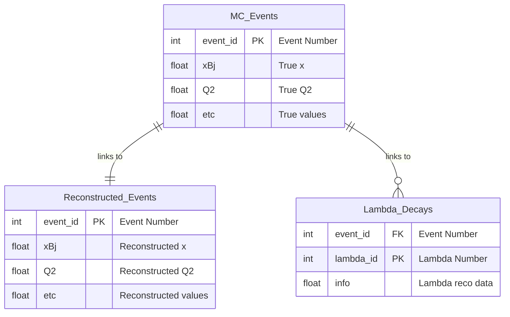

# CSV Data

We provide the relevant part `*.EDM4EIC.root` data converted to the CSV format 

- The CVS files are located in the same place as `*.edm4eic.root` files
- File names correspond to each other. E.g. `k_lambda_5x41_5000evt_001.*`
- Access to the CSV files is the same. See [DATA ACCESS](data) page
- CSV table names are embedded in extension before `.csv` , 
  e.g. `*.mcdis.csv`, `*.mcpart_lambda.csv`
- Column names are listed in the first line of the file (standard for CSV)

Example file names: 

```bash
# Original file
k_lambda_5x41_5000evt_001.edm4eic.root

# Related CSV-s
k_lambda_5x41_5000evt_001.mcdis.csv
k_lambda_5x41_5000evt_001.mcpart_lambda.csv
```


## Table definitions
 
For analyzing data, we can work with multiple CSV files that contain related information.
The files are linked relationally. The first columns of a CSV table is always 
a primary key (e.g. event number). Or a composite key (e.g. event number + particle index). 
For example, all data related to e.g. `k_lambda_5x41_5000evt_001.*` 
will refer the same events. 


These CSV files are essentially **database tables**, 
and understanding this relationship helps us organize and analyze data more effectively.

With python and pandas it is easy to organize them joined tables like 
`MCvsReconstructed events`

## mcdis


Files: `*.mcdis.csv`

True event level values that come from the event generator.
`evt` - evnet id in file, the rest of the names correspond to table: 
[mc-variables](http://localhost:5173/meson-structure/mc-variables.html)

Columns: 

```
evt
alphas
mx2
nu
p_rt
pdrest
pperps
pperpz
q2
s_e,s_q
tempvar
tprime
tspectator
twopdotk
twopdotq
w
x_d
xbj
y_d
yplus
```

## mcpart_lambda

Files: `*.mcpart_lambda.csv`

Full chane lambda decays by using `MCParticles` EDM4EIC table. 
MCParticles has relations like daughters and parents. Those relations are 
flattened for lambda decays. The column represent possible lambda decays are grouped by particles: 

Prefixes (each has the same parameters after)

1. `lam` - Λ 
1. `prot` - p (if pπ- decay or nulls)
1. `pimin` - π- (if pπ- decay or nulls)
1. `neut` - Neutron (if n π0 decay)
1. `pizero` - pi0 - (if n π0 decay)
1. `gamone` - γ one from π0 decay (if pi0 decays)
1. `gamtwo` - γ two from π0 decay (if pi0 decays)

For each particle prefix, the next columns are saved: 

01. `{0}_id`     -   id - particle index in MCParticles table
02. `{0}_pdg`    -   pdg - particle PDG
03. `{0}_gen`    -   gen - Generator Status (1 stable... probably)
04. `{0}_sim`    -   sim - Simulation Status (by Geant4)
05. `{0}_px`     -   px - Momentum
06. `{0}_py`     -   py
07. `{0}_pz`     -   pz
08. `{0}_vx`     -   vx - Origin vertex information
09. `{0}_vy`     -   vy
10. `{0}_vz`     -   vz
11. `{0}_epx`    -   epx - End Point (decay, or out of detector)
12. `{0}_epy`    -   epy
13. `{0}_epz`    -   epz
14. `{0}_time`   -   time - Time of origin
15. `{0}_nd`     -   nd - Number of daughters

So in the end the columns are: 

```yaml
evt,
lam_id,lam_pdg,lam_gen,lam_sim,lam_px,lam_py,lam_pz,lam_vx,lam_vy,lam_vz,lam_epx,lam_epy,lam_epz,lam_time,lam_nd,
prot_id,prot_pdg,prot_gen,prot_sim,prot_px,prot_py,prot_pz,prot_vx,prot_vy,prot_vz,prot_epx,prot_epy,prot_epz,prot_time,prot_nd,
pimin_id,pimin_pdg,pimin_gen,pimin_sim,pimin_px,pimin_py,pimin_pz,pimin_vx,pimin_vy,pimin_vz,pimin_epx,pimin_epy,pimin_epz,pimin_time,pimin_nd,neut_id,
neut_pdg,neut_gen,neut_sim,neut_px,neut_py,neut_pz,neut_vx,neut_vy,neut_vz,neut_epx,neut_epy,neut_epz,neut_time,neut_nd,
pizero_id,pizero_pdg,pizero_gen,pizero_sim,pizero_px,pizero_py,pizero_pz,pizero_vx,pizero_vy,pizero_vz,pizero_epx,pizero_epy,pizero_epz,pizero_time,pizero_nd,
gamone_id,gamone_pdg,gamone_gen,gamone_sim,gamone_px,gamone_py,gamone_pz,gamone_vx,gamone_vy,gamone_vz,gamone_epx,gamone_epy,gamone_epz,gamone_time,gamone_nd,
gamtwo_id,gamtwo_pdg,gamtwo_gen,gamtwo_sim,gamtwo_px,gamtwo_py,gamtwo_pz,gamtwo_vx,gamtwo_vy,gamtwo_vz,gamtwo_epx,gamtwo_epy,gamtwo_epz,gamtwo_time,gamtwo_nd
```

Notes:

- Particles may not be decayed. E.g. Lambda may just go outside of detector designated volume, 
  in this case `lam_nd` - Number of daughters will be 0 and the rest of columns will be null 


## Combine Multiple Files

When we have multiple CSV files from different runs or datasets, 
each file starts its event numbering from 0:

```
File 1: evt = [0, 1, 2, 3, 4, ...]
File 2: evt = [0, 1, 2, 3, 4, ...]  ← ID Collision!
File 3: evt = [0, 1, 2, 3, 4, ...]  ← ID Collision!
```

**Problem**: Event 0 from File 1 is completely different from Event 0 from File 2, 
but they have the same ID if read in pandas directly!

Use functions like this to read multiple files in one DF

```python
import pandas as pd
import glob

def concat_csvs_with_unique_events(files):
    """Load and concatenate CSV files with globally unique event IDs"""
    dfs = []
    offset = 0
    
    for file in files:
        df = pd.read_csv(file)
        df['evt'] = df['evt'] + offset  # Make IDs globally unique
        offset = df['evt'].max() + 1    # Set offset for next file
        dfs.append(df)
    
    return pd.concat(dfs, ignore_index=True)

# Load both tables with unique event IDs
lambda_df = concat_csvs_with_unique_events(sorted(glob.glob("mcpart_lambda*.csv")))
dis_df = concat_csvs_with_unique_events(sorted(glob.glob("dis_parameters*.csv")))
```

**Result**: Now we have globally unique event IDs:
```
File 1: evt = [0, 1, 2, 3, 4]
File 2: evt = [5, 6, 7, 8, 9]     ← No collision!  
File 3: evt = [10, 11, 12, 13, 14] ← No collision!
```
