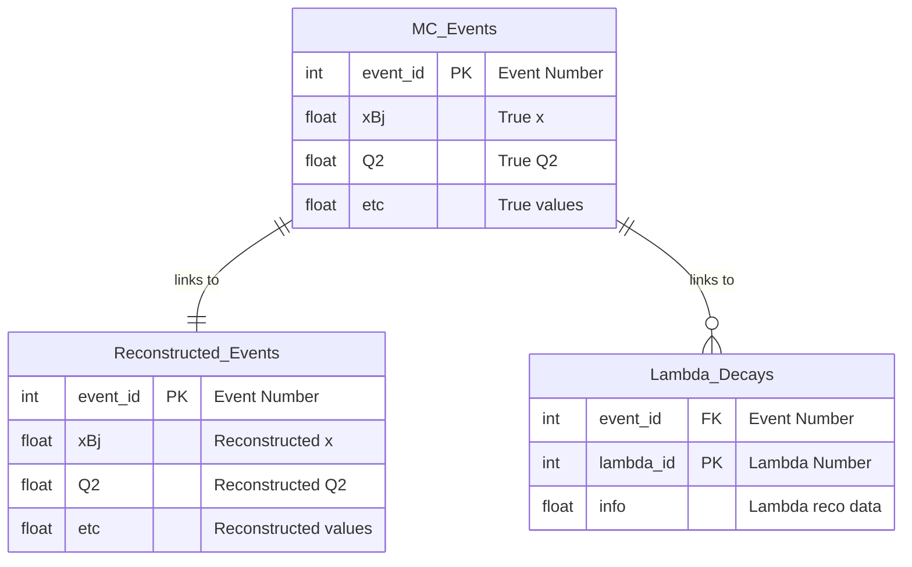

# CSV Data

We provide the relevant part `*.EDM4EIC.root` data converted to the CSV format 

- The CVS files are located in `csv` folder in the campaign directory. See [DATA ACCESS](data)
- File names start the same as source `edm4eic.root` file and correspond to each other. E.g. `k_lambda_5x41_5000evt_001.*`
- We also provide .csv.zip - zipped versions. Pandas can work with such files out of the box
- Access to the CSV and .csv.zip files is the same. See [DATA ACCESS](data) page
- CSV table names are embedded in extension before `.csv` , 
  e.g. `*.mcdis.csv`, `*.mcpart_lambda.csv`
- Column names are listed in the first line of the file (standard for CSV)

Example file names: 

```bash
# Original file
k_lambda_5x41_5000evt_001.edm4eic.root

# Related CSV-s
k_lambda_5x41_5000evt_001.mcdis.csv
k_lambda_5x41_5000evt_001.mcpart_lambda.csv

# Zi
```

All scripts that make EDM4HEP to CSV conversion are located at 
[csv_convert](https://github.com/JeffersonLab/meson-structure/tree/main/csv_convert) dir.

## Table definitions
 
For analyzing data, we can work with multiple CSV files that contain related information.
The files are linked relationally. The first columns of a CSV table is always 
a primary key (e.g. event number). Or a composite key (e.g. event number + particle index). 
For example, all data related to e.g. `k_lambda_5x41_5000evt_001.*` 
will refer the same events. 


```mermaid
erDiagram
    MC_Events {
        int event_id PK "Event Number"
        float xBj "True x"
        float Q2 "True Q2"
        float etc "True values"
    }
    Reconstructed_Events {
        int event_id PK "Event Number"
        float xBj "Reconstructed x"
        float Q2 "Reconstructed Q2"
        float etc "Reconstructed values"
    }
    Lambda_Decays {
        int event_id FK "Event Number"
        int lambda_id PK "Lambda Number"
        float info "Lambda reco data"
    }

    MC_Events ||--|| Reconstructed_Events : "links to"
    MC_Events ||--o{ Lambda_Decays : "links to"
```
These CSV files are essentially **database tables**, 
and understanding this relationship helps us organize and analyze data more effectively.

With python and pandas it is easy to organize them joined tables like 
`MCvsReconstructed events`

### mc_dis

- Files: `*.mc_dis.csv`
- Conversion script: [csv_convert/csv_mc_dis.cxx](https://github.com/JeffersonLab/meson-structure/blob/main/csv_convert/csv_mc_dis.cxx)

True event level values that come from the event generator.
`event` - evnet id in file, the rest of the names correspond to table: 
[mc-variables](mc-variables)

Columns: 

```
event
alphas
mx2
nu
p_rt
pdrest
pperps
pperpz
q2
s_e,s_q
tempvar
tprime
tspectator
twopdotk
twopdotq
w
x_d
xbj
y_d
yplus
```

### reco_dis

- Files: `*.reco_dis.csv`
- Conversion script: [csv_convert/csv_reco_dis.cxx](https://github.com/JeffersonLab/meson-structure/blob/main/csv_convert/csv_reco_dis.cxx)

Reconstructed (and true MC) event kinematic parameters including the reconstructed scattered electron information, beam particles, Lambda particles, and various t-value calculations. 

EICRecon provides several algorithms calculating the DIS kinematics. 
We save them all to CSV. E.g. `jb_q2` corresponds to Q2 obtained by Jacquet-Blondel method
and `electron_q2` corresponds to scattered electron method. 

#### DIS Kinematics Columns

Prefixes - EDM4EIC Collection name: 

1. `da`       - "InclusiveKinematicsDA"
2. `esigma`   - "InclusiveKinematicsESigma"
3. `electron` - "InclusiveKinematicsElectron"
4. `jb`       - "InclusiveKinematicsJB"
5. `ml`       - "InclusiveKinematicsML"
6. `sigma`    - "InclusiveKinematicsSigma"
7. `mc`       - True MC values from event parameters

For each kinematic method (da, esigma, electron, jb, ml, sigma, mc), variables are saved like: 

1. `{}_x`  - Bjorken x
2. `{}_q2` - Q² [GeV²]
3. `{}_y`  - Inelasticity y
4. `{}_nu` - Energy transfer ν [GeV]
5. `{}_w`  - Invariant mass W [GeV]

#### T-value Columns

The script calculates several t-values (momentum transfer squared) using different beam configurations:

1. `mc_true_t` - True t-value from MC event parameters (dis_tspectator)
2. `mc_lam_tb_t` - t calculated using MC Lambda and **true beam** proton
3. `mc_lam_exp_t` - t calculated using MC Lambda and **experimental beam** proton
4. `ff_lam_tb_t` - t calculated using far-forward reconstructed Lambda and **true beam**
5. `ff_lam_exp_t` - t calculated using far-forward reconstructed Lambda and **experimental beam**

**Important Physics Note**: 
- **True beam** uses the actual MC beam proton momentum from the simulation
- **Experimental beam** approximates what we would know in a real experiment:
  - Detects the beam mode (41, 100, 130, or 275 GeV) from the true momentum
  - Applies crossing angles: 25 mrad horizontal, 100 μrad vertical
  - This mimics experimental conditions where we don't know the exact beam momentum

#### Scattered Electron Columns

For the reconstructed scattered electron (from the Electron method):

1.  `elec_id`              - Particle index in ReconstructedParticles collection
2.  `elec_energy`          - Total energy [GeV]
3.  `elec_px`              - Momentum x-component [GeV/c]
4.  `elec_py`              - Momentum y-component [GeV/c]
5.  `elec_pz`              - Momentum z-component [GeV/c]
6.  `elec_ref_x`           - Reference point x-coordinate
7.  `elec_ref_y`           - Reference point y-coordinate
8.  `elec_ref_z`           - Reference point z-coordinate
9.  `elec_pid_goodness`    - Particle ID quality metric
10. `elec_type`            - Reconstruction type flag
11. `elec_n_clusters`      - Number of associated clusters
12. `elec_n_tracks`        - Number of associated tracks
13. `elec_n_particles`     - Number of daughter particles
14. `elec_n_particle_ids`  - Number of particle ID objects

#### MC Scattered Electron Momentum

1. `mc_elec_px` - MC truth scattered electron px [GeV/c]
2. `mc_elec_py` - MC truth scattered electron py [GeV/c]
3. `mc_elec_pz` - MC truth scattered electron pz [GeV/c]

#### Lambda Momentum Columns

MC truth Lambda:
1. `mc_lam_px` - MC Lambda px [GeV/c]
2. `mc_lam_py` - MC Lambda py [GeV/c]
3. `mc_lam_pz` - MC Lambda pz [GeV/c]

Far-forward reconstructed Lambda:
1. `ff_lam_px` - Far-forward Lambda px [GeV/c]
2. `ff_lam_py` - Far-forward Lambda py [GeV/c]
3. `ff_lam_pz` - Far-forward Lambda pz [GeV/c]

#### Beam Particle Momentum Columns

MC beam proton:
1. `mc_beam_prot_px` - Beam proton px [GeV/c]
2. `mc_beam_prot_py` - Beam proton py [GeV/c]
3. `mc_beam_prot_pz` - Beam proton pz [GeV/c]

MC beam electron:
1. `mc_beam_elec_px` - Beam electron px [GeV/c]
2. `mc_beam_elec_py` - Beam electron py [GeV/c]
3. `mc_beam_elec_pz` - Beam electron pz [GeV/c]

`event` is the first column = event number. 

So the complete column list is:

```
event,
da_x,da_q2,da_y,da_nu,da_w,
esigma_x,esigma_q2,esigma_y,esigma_nu,esigma_w,
electron_x,electron_q2,electron_y,electron_nu,electron_w,
jb_x,jb_q2,jb_y,jb_nu,jb_w,
ml_x,ml_q2,ml_y,ml_nu,ml_w,
sigma_x,sigma_q2,sigma_y,sigma_nu,sigma_w,
mc_x,mc_q2,mc_y,mc_nu,mc_w,
mc_true_t,mc_lam_tb_t,mc_lam_exp_t,ff_lam_tb_t,ff_lam_exp_t,
elec_id,elec_energy,elec_px,elec_py,elec_pz,elec_ref_x,elec_ref_y,elec_ref_z,elec_pid_goodness,elec_type,elec_n_clusters,elec_n_tracks,elec_n_particles,elec_n_particle_ids,
mc_elec_px,mc_elec_py,mc_elec_pz,
mc_lam_px,mc_lam_py,mc_lam_pz,
ff_lam_px,ff_lam_py,ff_lam_pz,
mc_beam_prot_px,mc_beam_prot_py,mc_beam_prot_pz,
mc_beam_elec_px,mc_beam_elec_py,mc_beam_elec_pz
```

Notes:

- The electron particle information is only available when the Electron method successfully reconstructs the scattered electron
- If particles are not found/reconstructed, their columns will contain null values
- T-values are calculated as t = (p1 - p2)² using 4-vectors
- The experimental beam approximation is crucial for understanding systematic uncertainties in real experiments


### mcpart_lambda

- Files: `*.mcpart_lambda.csv`
- Conversion script: [csv_convert/csv_mcpart_lambda.cxx](https://github.com/JeffersonLab/meson-structure/blob/main/csv_convert/csv_mcpart_lambda.cxx)

Full MC particles information for a lambda decays chain by using `MCParticles` EDM4EIC table. 
MCParticles has relations like daughters and parents. Those relations are 
flattened by lambda decay. 
The columns represent possible lambda decays are grouped by particles: 

Prefixes (each has the same parameters after)

1. `lam` - Λ 
2. `prot` - p (if pπ- decay or nulls)
3. `pimin` - π- (if pπ- decay or nulls)
4. `neut` - Neutron (if n π0 decay)
5. `pizero` - pi0 - (if n π0 decay)
6. `gamone` - γ one from π0 decay (if pi0 decays)
7. `gamtwo` - γ two from π0 decay (if pi0 decays)

For each particle prefix, the next columns are saved: 

1.  `{0}_id`     -   id - particle index in MCParticles table
2.  `{0}_pdg`    -   pdg - particle PDG
3.  `{0}_gen`    -   gen - Generator Status (1 stable... probably)
4.  `{0}_sim`    -   sim - Simulation Status (by Geant4)
5.  `{0}_px`     -   px - Momentum
6.  `{0}_py`     -   py
7.  `{0}_pz`     -   pz
8.  `{0}_vx`     -   vx - Origin vertex information
9.  `{0}_vy`     -   vy
10. `{0}_vz`     -   vz
11. `{0}_epx`    -   epx - End Point (decay, or out of detector)
12. `{0}_epy`    -   epy
13. `{0}_epz`    -   epz
14. `{0}_time`   -   time - Time of origin
15. `{0}_nd`     -   nd - Number of daughters

In addition to the particle blocks, each row starts with two **event/decay** columns:

1. `event`          — event number (primary key).
2. `lam_is_first`   — `1` if this Λ is the first Λ encountered in the event (the generated
   spectator Λ), else `0`. One row per Λ is written, so files can contain multiple rows
   per event if more than one Λ appears.
3. `lam_decay`      — decay-channel code (see table below). This is the **shared decay code**
   used by all three Λ CSVs (`mcpart_lambda`, `acceptance_npi0`, `acceptance_ppim`).

| Code | Meaning                          | Daughter rule                 |
|:----:|----------------------------------|-------------------------------|
|  0   | Not decayed                      | `daughters.size() == 0`       |
|  1   | Λ → p π⁻                         | 2 daughters: PDG 2212 + PDG -211   |
|  2   | Λ → n π⁰                         | 2 daughters: PDG 2112 + PDG 111    |
|  3   | Shower                           | `daughters.size() > 2` (any)  |
|  4   | Only p                           | 1 daughter, PDG 2212          |
|  5   | Only π⁺                          | 1 daughter, PDG 211           |
|  6   | Only n                           | 1 daughter, PDG 2112          |
|  7   | Only π⁰                          | 1 daughter, PDG 111           |
|  8   | Other                            | anything not matching above   |

So in the end the columns are:

```yaml
event,lam_is_first,lam_decay,
lam_id,lam_pdg,lam_gen,lam_sim,lam_px,lam_py,lam_pz,lam_vx,lam_vy,lam_vz,lam_epx,lam_epy,lam_epz,lam_time,lam_nd,
prot_id,prot_pdg,prot_gen,prot_sim,prot_px,prot_py,prot_pz,prot_vx,prot_vy,prot_vz,prot_epx,prot_epy,prot_epz,prot_time,prot_nd,
pimin_id,pimin_pdg,pimin_gen,pimin_sim,pimin_px,pimin_py,pimin_pz,pimin_vx,pimin_vy,pimin_vz,pimin_epx,pimin_epy,pimin_epz,pimin_time,pimin_nd,
neut_id,neut_pdg,neut_gen,neut_sim,neut_px,neut_py,neut_pz,neut_vx,neut_vy,neut_vz,neut_epx,neut_epy,neut_epz,neut_time,neut_nd,
pizero_id,pizero_pdg,pizero_gen,pizero_sim,pizero_px,pizero_py,pizero_pz,pizero_vx,pizero_vy,pizero_vz,pizero_epx,pizero_epy,pizero_epz,pizero_time,pizero_nd,
gamone_id,gamone_pdg,gamone_gen,gamone_sim,gamone_px,gamone_py,gamone_pz,gamone_vx,gamone_vy,gamone_vz,gamone_epx,gamone_epy,gamone_epz,gamone_time,gamone_nd,
gamtwo_id,gamtwo_pdg,gamtwo_gen,gamtwo_sim,gamtwo_px,gamtwo_py,gamtwo_pz,gamtwo_vx,gamtwo_vy,gamtwo_vz,gamtwo_epx,gamtwo_epy,gamtwo_epz,gamtwo_time,gamtwo_nd
```

Notes:

- Particles may not be decayed. E.g. Lambda may just go outside of detector designated volume,
  in this case `lam_nd` - Number of daughters will be 0 and the rest of columns will be null.
- Particle-block columns that don't apply to the observed decay channel are left empty
  (e.g. `neut_*`, `pizero_*`, `gamone_*`, `gamtwo_*` are empty when `lam_decay == 1`).


### acceptance_npi0

- Files: `*.acceptance_npi0.csv`
- Conversion script: [csv_convert/csv_edm4hep_acceptance_npi0.cxx](https://github.com/JeffersonLab/meson-structure/blob/main/csv_convert/csv_edm4hep_acceptance_npi0.cxx)

Same per-Λ rows as [mcpart_lambda](#mcpart_lambda), **plus** per-particle MC-truth acceptance
flags for the Λ → n π⁰ → n γ γ chain. One row per first Λ per event. Detection flags are
`1` only when the Λ decayed via n+π⁰ **and** the π⁰ produced two observable photons; otherwise
they are `0`. A flag is `1` iff the particle contributed to at least one SimCalorimeterHit in
that detector collection.

Column prefix (identical to `mcpart_lambda`):

```yaml
event,lam_is_first,lam_decay,
<lam_*>, <prot_*>, <pimin_*>, <neut_*>, <pizero_*>, <gamone_*>, <gamtwo_*>
```

Followed by detection flags (column name = `<particle>_<EDM4hep collection name>`):

Neutron in HCALs:

1. `neut_HcalFarForwardZDCHits`
2. `neut_HcalEndcapPInsertHits`
3. `neut_LFHCALHits`

Gamma-one in ECALs:

4. `gamone_EcalFarForwardZDCHits`
5. `gamone_B0ECalHits`
6. `gamone_EcalEndcapPHits`
7. `gamone_EcalEndcapPInsertHits`

Gamma-two in ECALs (same four):

8. `gamtwo_EcalFarForwardZDCHits`
9. `gamtwo_B0ECalHits`
10. `gamtwo_EcalEndcapPHits`
11. `gamtwo_EcalEndcapPInsertHits`

Full header ordering:

```yaml
event,lam_is_first,lam_decay,
lam_id,…,lam_nd, prot_id,…,prot_nd, pimin_id,…,pimin_nd,
neut_id,…,neut_nd, pizero_id,…,pizero_nd, gamone_id,…,gamone_nd, gamtwo_id,…,gamtwo_nd,
neut_HcalFarForwardZDCHits, neut_HcalEndcapPInsertHits, neut_LFHCALHits,
gamone_EcalFarForwardZDCHits, gamtwo_EcalFarForwardZDCHits,
gamone_B0ECalHits,             gamtwo_B0ECalHits,
gamone_EcalEndcapPHits,        gamtwo_EcalEndcapPHits,
gamone_EcalEndcapPInsertHits,  gamtwo_EcalEndcapPInsertHits
```

Notes:

- Detection flags are `0` for all non-n+π⁰ decays (nothing is looked up for those rows).
- `has hit` means the MCParticle appears in at least one
  `SimCalorimeterHit::getContributions()` of the collection.


### acceptance_ppim

- Files: `*.acceptance_ppim.csv`
- Conversion script: [csv_convert/csv_edm4hep_acceptance_ppim.cxx](https://github.com/JeffersonLab/meson-structure/blob/main/csv_convert/csv_edm4hep_acceptance_ppim.cxx)

Per-event acceptance flags for the Λ → p π⁻ channel. **Only events whose first-reachable Λ
is a p π⁻ decay produce a row.** `lam_decay` is therefore always `1` in this file (it is
kept for schema consistency with the other two Λ CSVs).

Each particle (`prot`, `pimin`) gets a per-collection `0/1` flag for **every** EDM4hep
tracker and calorimeter collection. Column names use the **full EDM4hep collection name**:
`<particle>_<CollectionName>`.

Tracker collections (17) checked for both `prot` and `pimin`:

```
B0TrackerHits, BackwardMPGDEndcapHits, DIRCBarHits, DRICHHits,
ForwardMPGDEndcapHits, ForwardOffMTrackerHits, ForwardRomanPotHits,
LumiSpecTrackerHits, MPGDBarrelHits, OuterMPGDBarrelHits,
RICHEndcapNHits, SiBarrelHits, TOFBarrelHits, TOFEndcapHits,
TaggerTrackerHits, TrackerEndcapHits, VertexBarrelHits
```

Calorimeter collections (7) checked for both `prot` and `pimin`:

```
EcalFarForwardZDCHits, B0ECalHits, EcalEndcapPHits, EcalEndcapPInsertHits,
HcalFarForwardZDCHits, HcalEndcapPInsertHits, LFHCALHits
```

Flag rule: `1` if the particle has at least one hit (tracker:
`SimTrackerHit::getParticle()` matches; calo: any contribution matches), else `0`.

Full header ordering:

```yaml
event,lam_is_first,lam_decay,
lam_id,…,lam_nd, prot_id,…,prot_nd, pimin_id,…,pimin_nd,
prot_<tracker-1>,…,prot_<tracker-17>,
prot_<calo-1>,…,prot_<calo-7>,
pimin_<tracker-1>,…,pimin_<tracker-17>,
pimin_<calo-1>,…,pimin_<calo-7>
```

#### Companion hit-detail CSVs

The ppim script additionally writes two **long-format** per-hit CSVs, one row per hit:

- `*.acceptance_ppim_prot_hits.csv` — detailed hits belonging to the proton candidate
- `*.acceptance_ppim_pimin_hits.csv` — detailed hits belonging to the π⁻ candidate

Columns (identical for both):

| Column       | Description                                                             |
|--------------|-------------------------------------------------------------------------|
| `event`      | Event number (join key to the main ppim CSV).                           |
| `lam_id`     | MCParticle index of the parent Λ (join key to `lam_id` in main CSV).    |
| `detector`   | EDM4hep collection name (`B0TrackerHits`, `HcalFarForwardZDCHits`, …).  |
| `hit_id`     | `SimHit::getObjectID().index`.                                          |
| `x,y,z`      | Hit position [mm].                                                      |
| `eDep`       | Energy deposit [GeV] (tracker: `getEDep()`, calo: `getEnergy()`).       |
| `time`       | Hit time [ns]. For calo hits taken from the first matching contribution.|
| `pathLength` | Tracker `getPathLength()`. **Always `0` for calorimeter rows.**         |

Join pattern:

```python
import pandas as pd
main = pd.read_csv("run.acceptance_ppim.csv")
prot_hits = pd.read_csv("run.acceptance_ppim_prot_hits.csv")
merged = prot_hits.merge(main, on=["event"], suffixes=("_hit", ""))
```


### reco_ff_lambdas

- Files: `*.reco_ff_lambdas_ngamgam.csv`
- Conversion script: [csv_convert/csv_reco_ff_lambda.cxx](https://github.com/JeffersonLab/meson-structure/blob/main/csv_convert/csv_reco_ff_lambda.cxx)

Reconstructed Lambda particles and their decay products from the far-forward Zero Degree Calorimeter (ZDC), specifically for the decay channel Λ → n + π⁰ → n + γ + γ. This table uses the `ReconstructedFarForwardZDCLambdas` collection from EDM4EIC and flattens the decay hierarchy similar to `mcpart_lambda`.

The columns are grouped by particles in the decay chain:

Prefixes (each has the same parameters after):

1. `lam` - Λ (Lambda baryon)
2. `neut` - Neutron from Λ decay
3. `gam1` - First γ from π⁰ decay
4. `gam2` - Second γ from π⁰ decay

For each particle prefix, the following columns are saved:

1.  `{0}_id`              - id - particle index in ReconstructedParticles collection
2.  `{0}_pdg`             - pdg - particle PDG code
3.  `{0}_charge`          - charge - electric charge
4.  `{0}_energy`          - energy - total energy [GeV]
5.  `{0}_mass`            - mass - invariant mass [GeV/c²]
6.  `{0}_px`              - px - momentum x-component [GeV/c]
7.  `{0}_py`              - py - momentum y-component [GeV/c]
8.  `{0}_pz`              - pz - momentum z-component [GeV/c]
9.  `{0}_ref_x`           - ref_x - reference point x-coordinate
10. `{0}_ref_y`           - ref_y - reference point y-coordinate
11. `{0}_ref_z`           - ref_z - reference point z-coordinate
12. `{0}_pid_goodness`    - pid_goodness - particle ID quality metric
13. `{0}_type`            - type - reconstruction type flag
14. `{0}_n_clusters`      - n_clusters - number of associated clusters
15. `{0}_n_tracks`        - n_tracks - number of associated tracks
16. `{0}_n_particles`     - n_particles - number of daughter particles
17. `{0}_n_particle_ids`  - n_particle_ids - number of particle ID objects
18. `{0}_cov_xx`          - cov_xx - covariance matrix element
19. `{0}_cov_xy`          - cov_xy - covariance matrix element
20. `{0}_cov_xz`          - cov_xz - covariance matrix element
21. `{0}_cov_yy`          - cov_yy - covariance matrix element
22. `{0}_cov_yz`          - cov_yz - covariance matrix element
23. `{0}_cov_zz`          - cov_zz - covariance matrix element
24. `{0}_cov_xt`          - cov_xt - covariance matrix element
25. `{0}_cov_yt`          - cov_yt - covariance matrix element
26. `{0}_cov_zt`          - cov_zt - covariance matrix element
27. `{0}_cov_tt`          - cov_tt - covariance matrix element

The complete column list is:

```yaml
event,
lam_id,lam_pdg,lam_charge,lam_energy,lam_mass,lam_px,lam_py,lam_pz,lam_ref_x,lam_ref_y,lam_ref_z,lam_pid_goodness,lam_type,lam_n_clusters,lam_n_tracks,lam_n_particles,lam_n_particle_ids,lam_cov_xx,lam_cov_xy,lam_cov_xz,lam_cov_yy,lam_cov_yz,lam_cov_zz,lam_cov_xt,lam_cov_yt,lam_cov_zt,lam_cov_tt,
neut_id,neut_pdg,neut_charge,neut_energy,neut_mass,neut_px,neut_py,neut_pz,neut_ref_x,neut_ref_y,neut_ref_z,neut_pid_goodness,neut_type,neut_n_clusters,neut_n_tracks,neut_n_particles,neut_n_particle_ids,neut_cov_xx,neut_cov_xy,neut_cov_xz,neut_cov_yy,neut_cov_yz,neut_cov_zz,neut_cov_xt,neut_cov_yt,neut_cov_zt,neut_cov_tt,
gam1_id,gam1_pdg,gam1_charge,gam1_energy,gam1_mass,gam1_px,gam1_py,gam1_pz,gam1_ref_x,gam1_ref_y,gam1_ref_z,gam1_pid_goodness,gam1_type,gam1_n_clusters,gam1_n_tracks,gam1_n_particles,gam1_n_particle_ids,gam1_cov_xx,gam1_cov_xy,gam1_cov_xz,gam1_cov_yy,gam1_cov_yz,gam1_cov_zz,gam1_cov_xt,gam1_cov_yt,gam1_cov_zt,gam1_cov_tt,
gam2_id,gam2_pdg,gam2_charge,gam2_energy,gam2_mass,gam2_px,gam2_py,gam2_pz,gam2_ref_x,gam2_ref_y,gam2_ref_z,gam2_pid_goodness,gam2_type,gam2_n_clusters,gam2_n_tracks,gam2_n_particles,gam2_n_particle_ids,gam2_cov_xx,gam2_cov_xy,gam2_cov_xz,gam2_cov_yy,gam2_cov_yz,gam2_cov_zz,gam2_cov_xt,gam2_cov_yt,gam2_cov_zt,gam2_cov_tt
```

Notes:

- ZDC reconstructed lambdas look only Lambda decays (Λ → n + π⁰ → n + γ + γ channel)
- If a particle is not reconstructed or missing, its columns will contain null values
- The `n_particles` field for the Lambda indicates the number of reconstructed daughter particles

### ppim_combinatorics

- Files: `*.ppim_combinatorics.csv`
- Conversion script: [csv_convert/csv_edm4hep_combinatorics_ppim.cxx](https://github.com/JeffersonLab/meson-structure/blob/main/csv_convert/csv_edm4hep_combinatorics_ppim.cxx)
- Analysis script: [csv_convert/analyse_ppim_combinatorics.py](https://github.com/JeffersonLab/meson-structure/blob/main/csv_convert/analyse_ppim_combinatorics.py)

Combinatoric proton + π⁻ candidate pairs for Λ → p + π⁻ searches using far-forward detectors.
**Each row is one (proton candidate, pion candidate) pair** found in an event — events with zero
candidates produce no rows.

**Candidate selection (MC-truth level):**

| Candidate | Detector collection | Min hits |
|-----------|---------------------|----------|
| Proton | `ForwardRomanPotHits` | ≥ 2 |
| Pion (π⁻) | `B0TrackerHits` | ≥ 3 |

Pion candidates are additionally checked against `B0ECalHits` contributions; a flag records
whether any calorimeter energy was deposited.

**Truth matching:**
The script locates the primary Λ in each event and stores its true daughter particle IDs in
`true_prot_id` / `true_pi_id` (both are `-1` when no primary Λ decay is found). The
`is_true_lam` flag is `1` when the row's candidate pair exactly matches those true daughters.

> **Note:** the event-ID column is `evt` (not `event` as in other tables).

#### Columns

Event / truth metadata:

1. `evt`           — event number
2. `is_true_lam`   — 1 if this pair is the true p + π⁻ from the primary Λ, else 0
3. `true_prot_id`  — MCParticle index of the true Lambda daughter proton (−1 if none)
4. `true_pi_id`    — MCParticle index of the true Lambda daughter π⁻ (−1 if none)

Pion candidate — MCParticle info (same 15-field schema as other tables, prefix `pi`):

5–19. `pi_id, pi_pdg, pi_gen, pi_sim, pi_px, pi_py, pi_pz, pi_vx, pi_vy, pi_vz, pi_epx, pi_epy, pi_epz, pi_time, pi_nd`

Pion candidate — B0 tracker hit info:

20. `pi_nhits_b0`             — number of B0TrackerHits for this candidate
21. `pi_first_b0_x`           — x of first registered B0TrackerHit [mm]
22. `pi_first_b0_y`           — y of first registered B0TrackerHit [mm]
23. `pi_first_b0_z`           — z of first registered B0TrackerHit [mm]

Pion candidate — B0 ECal contribution:

24. `pi_ecal_contrib`         — 1 if candidate left ≥1 hit contribution in B0ECalHits, else 0
25. `pi_first_ecal_x`         — x of first B0ECal cell with contribution [mm] (0 if none)
26. `pi_first_ecal_y`         — y of first B0ECal cell with contribution [mm] (0 if none)
27. `pi_first_ecal_z`         — z of first B0ECal cell with contribution [mm] (0 if none)

Proton candidate — MCParticle info (prefix `prot`):

28–42. `prot_id, prot_pdg, prot_gen, prot_sim, prot_px, prot_py, prot_pz, prot_vx, prot_vy, prot_vz, prot_epx, prot_epy, prot_epz, prot_time, prot_nd`

Proton candidate — Roman Pot hit info:

43. `prot_nhits_rp`           — number of ForwardRomanPotHits for this candidate
44. `prot_first_rp_x`         — x of first registered ForwardRomanPotHit [mm]
45. `prot_first_rp_y`         — y of first registered ForwardRomanPotHit [mm]
46. `prot_first_rp_z`         — z of first registered ForwardRomanPotHit [mm]

Complete column list:

```
evt,
is_true_lam,true_prot_id,true_pi_id,
pi_id,pi_pdg,pi_gen,pi_sim,pi_px,pi_py,pi_pz,pi_vx,pi_vy,pi_vz,pi_epx,pi_epy,pi_epz,pi_time,pi_nd,
pi_nhits_b0,pi_first_b0_x,pi_first_b0_y,pi_first_b0_z,
pi_ecal_contrib,pi_first_ecal_x,pi_first_ecal_y,pi_first_ecal_z,
prot_id,prot_pdg,prot_gen,prot_sim,prot_px,prot_py,prot_pz,prot_vx,prot_vy,prot_vz,prot_epx,prot_epy,prot_epz,prot_time,prot_nd,
prot_nhits_rp,prot_first_rp_x,prot_first_rp_y,prot_first_rp_z
```

Notes:

- Because rows are only written when at least one proton **and** one pion candidate exist, events
  with zero candidates are absent from the file entirely.
- Columns `true_prot_id` / `true_pi_id` can be joined against `pi_id` / `prot_id` to identify
  **reversed assignments** — cases where the true proton reached B0 and the true pion reached the
  Roman Pots — using `analyse_ppim_combinatorics.py`.
- When combining multiple files, offset `evt` the same way as `event` in other tables
  (see [Combine Multiple Files](#combine-multiple-files) below).


## Combine Multiple Files

When we have multiple CSV files from different runs or datasets, 
each file starts its event numbering from 0:

```
File 1: event = [0, 1, 2, 3, 4, ...]
File 2: event = [0, 1, 2, 3, 4, ...]  ← ID Collision!
File 3: event = [0, 1, 2, 3, 4, ...]  ← ID Collision!
```

**Problem**: Event 0 from File 1 is completely different from Event 0 from File 2, 
but they have the same ID if read in pandas directly!

Use functions like this to read multiple files in one DF

```python
import pandas as pd
import glob

def concat_csvs_with_unique_events(files):
    """Load and concatenate CSV files with globally unique event IDs"""
    dfs = []
    offset = 0
    
    for file in files:
        df = pd.read_csv(file)
        df['event'] = df['event'] + offset  # Make IDs globally unique
        offset = df['event'].max() + 1    # Set offset for next file
        dfs.append(df)
    
    return pd.concat(dfs, ignore_index=True)

# Load both tables with unique event IDs
lambda_df = concat_csvs_with_unique_events(sorted(glob.glob("mcpart_lambda*.csv")))
dis_df = concat_csvs_with_unique_events(sorted(glob.glob("dis_parameters*.csv")))
```

**Result**: Now we have globally unique event IDs:
```
File 1: event = [0, 1, 2, 3, 4]
File 2: event = [5, 6, 7, 8, 9]     ← No collision!  
File 3: event = [10, 11, 12, 13, 14] ← No collision!
```
