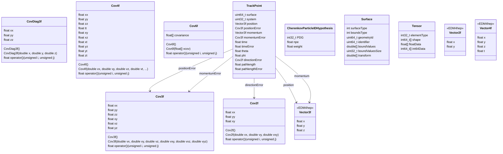

# EDM4EIC diagram

- [EDM4EIC yaml](https://github.com/eic/EDM4eic/blob/main/edm4eic.yaml)
- This diagram is made for EDM4EIC [v8.2.0](https://github.com/eic/EDM4eic/releases/tag/v8.2.0)

## Main Data Model 
 
Primary physics objects (particles, tracks, clusters, vertices, associations)

```mermaid
classDiagram
    %% Main Data Types
    
    class SimPulse {
        uint64_t cellID
        float integral
        Vector3f position
        float time
        float interval
        float[] amplitude
    }
    
    class ReconstructedParticle {
        int32_t type
        float energy
        Vector3f momentum
        Vector3f referencePoint
        float charge
        float mass
        float goodnessOfPID
        Cov4f covMatrix
        int32_t PDG
    }
    
    class CalorimeterHit {
        uint64_t cellID
        float energy
        float energyError
        float time
        float timeError
        Vector3f position
        Vector3f dimension
        int32_t sector
        int32_t layer
        Vector3f local
    }
    
    class ProtoCluster {
        float[] weights
    }
    
    class Cluster {
        int32_t type
        float energy
        float energyError
        float time
        float timeError
        uint32_t nhits
        Vector3f position
        Cov3f positionError
        float intrinsicTheta
        float intrinsicPhi
        Cov2f intrinsicDirectionError
        float[] shapeParameters
        float[] hitContributions
        float[] subdetectorEnergies
    }
    
    class PMTHit {
        uint64_t cellID
        float npe
        float time
        float timeError
        Vector3f position
        Vector3f dimension
        int32_t sector
        Vector3f local
    }
    
    class CherenkovParticleID {
        float npe
        float refractiveIndex
        float photonEnergy
        CherenkovParticleIDHypothesis[] hypotheses
        Vector2f[] thetaPhiPhotons
    }
    
    class RingImage {
        float npe
        Vector3f position
        Vector3f positionError
        float theta
        float thetaError
        float radius
        float radiusError
    }
    
    class RawTrackerHit {
        uint64_t cellID
        int32_t charge
        int32_t timeStamp
    }
    
    class TrackerHit {
        uint64_t cellID
        Vector3f position
        CovDiag3f positionError
        float time
        float timeError
        float edep
        float edepError
    }
    
    class Measurement2D {
        uint64_t surface
        Vector2f loc
        float time
        Cov3f covariance
        float[] weights
    }
    
    class TrackSeed {
        Vector3f perigee
    }
    
    class Trajectory {
        uint32_t type
        uint32_t nStates
        uint32_t nMeasurements
        uint32_t nOutliers
        uint32_t nHoles
        uint32_t nSharedHits
        float[] measurementChi2
        float[] outlierChi2
    }
    
    class TrackParameters {
        int32_t type
        uint64_t surface
        Vector2f loc
        float theta
        float phi
        float qOverP
        float time
        int32_t pdg
        Cov6f covariance
    }
    
    class Track {
        int32_t type
        Vector3f position
        Vector3f momentum
        Cov6f positionMomentumCovariance
        float time
        float timeError
        float charge
        float chi2
        uint32_t ndf
        int32_t pdg
    }
    
    class TrackSegment {
        float length
        float lengthError
        TrackPoint[] points
    }
    
    class Vertex {
        int32_t type
        float chi2
        int ndf
        Vector4f position
        Cov4f positionError
    }
    
    class InclusiveKinematics {
        float x
        float Q2
        float W
        float y
        float nu
    }
    
    class HadronicFinalState {
        float sigma
        float pT
        float gamma
    }
    
    class MCRecoParticleAssociation {
        uint32_t simID
        uint32_t recID
        float weight
    }
    
    class MCRecoClusterParticleAssociation {
        uint32_t simID
        uint32_t recID
        float weight
    }
    
    class MCRecoTrackParticleAssociation {
        uint32_t simID
        uint32_t recID
        float weight
    }
    
    class MCRecoVertexParticleAssociation {
        uint32_t simID
        uint32_t recID
        float weight
    }
    
    class MCRecoTrackerHitAssociation {
        float weight
    }
    
    class MCRecoCalorimeterHitAssociation {
        float weight
    }
    
    class TrackClusterMatch {
        float weight
    }
    
    %% External classes (from EDM4hep)
    class SimCalorimeterHit
    class SimTrackerHit
    class MCParticle
    class RawCalorimeterHit
    class ParticleID
    
    %% Relationships
    
    %% SimPulse relationships
    SimPulse --o SimCalorimeterHit : calorimeterHits
    SimPulse --o SimTrackerHit : trackerHits
    SimPulse --o SimPulse : pulses
    SimPulse --o MCParticle : particles
    
    %% ReconstructedParticle relationships
    ReconstructedParticle --> Vertex : startVertex
    ReconstructedParticle --> ParticleID : particleIDUsed
    ReconstructedParticle --o Cluster : clusters
    ReconstructedParticle --o Track : tracks
    ReconstructedParticle --o ReconstructedParticle : particles
    ReconstructedParticle --o ParticleID : particleIDs
    
    %% CalorimeterHit relationships
    CalorimeterHit --> RawCalorimeterHit : rawHit
    
    %% ProtoCluster relationships
    ProtoCluster --o CalorimeterHit : hits
    
    %% Cluster relationships
    Cluster --o Cluster : clusters
    Cluster --o CalorimeterHit : hits
    Cluster --o ParticleID : particleIDs
    
    %% CherenkovParticleID relationships
    CherenkovParticleID --> TrackSegment : chargedParticle
    CherenkovParticleID --o MCRecoTrackerHitAssociation : rawHitAssociations
    
    %% TrackerHit relationships
    TrackerHit --> RawTrackerHit : rawHit
    
    %% Measurement2D relationships
    Measurement2D --o TrackerHit : hits
    
    %% TrackSeed relationships
    TrackSeed --o TrackerHit : hits
    TrackSeed --> TrackParameters : params
    
    %% Trajectory relationships
    Trajectory --o TrackParameters : trackParameters
    Trajectory --o Measurement2D : measurements_deprecated
    Trajectory --o Measurement2D : outliers_deprecated
    Trajectory --> TrackSeed : seed
    
    %% Track relationships
    Track --> Trajectory : trajectory
    Track --o Measurement2D : measurements
    Track --o Track : tracks
    
    %% TrackSegment relationships
    TrackSegment --> Track : track
    
    %% Vertex relationships
    Vertex --o ReconstructedParticle : associatedParticles
    
    %% InclusiveKinematics relationships
    InclusiveKinematics --> ReconstructedParticle : scat
    
    %% HadronicFinalState relationships
    HadronicFinalState --o ReconstructedParticle : hadrons
    
    %% MCRecoParticleAssociation relationships
    MCRecoParticleAssociation --> ReconstructedParticle : rec
    MCRecoParticleAssociation --> MCParticle : sim
    
    %% MCRecoClusterParticleAssociation relationships
    MCRecoClusterParticleAssociation --> Cluster : rec
    MCRecoClusterParticleAssociation --> MCParticle : sim
    
    %% MCRecoTrackParticleAssociation relationships
    MCRecoTrackParticleAssociation --> Track : rec
    MCRecoTrackParticleAssociation --> MCParticle : sim
    
    %% MCRecoVertexParticleAssociation relationships
    MCRecoVertexParticleAssociation --> Vertex : rec
    MCRecoVertexParticleAssociation --> MCParticle : sim
    
    %% MCRecoTrackerHitAssociation relationships
    MCRecoTrackerHitAssociation --> RawTrackerHit : rawHit
    MCRecoTrackerHitAssociation --> SimTrackerHit : simHit
    
    %% MCRecoCalorimeterHitAssociation relationships
    MCRecoCalorimeterHitAssociation --> RawCalorimeterHit : rawHit
    MCRecoCalorimeterHitAssociation --> SimCalorimeterHit : simHit
    
    %% TrackClusterMatch relationships
    TrackClusterMatch --> Cluster : cluster
    TrackClusterMatch --> Track : track
    
    %% Links
    Track ..> ProtoCluster : TrackProtoClusterLink
```




---

## Components/Utilities

Supporting structures like:
   - Covariance matrices (Cov2f, Cov3f, etc.)
   - Utility classes (Surface, Tensor, etc.)
   - Component types (TrackPoint, Hypothesis classes, etc.)
   - External types from other packages (Vector3f, etc, etc.)


The prompt used to convert: 

```
Here is edm4eic yaml. Please convert it to mermaid diagrams. 
The main diagram should focus on the core physics data flow, while utility structures go in a separate diagram.

# Quick Instructions: YAML to Mermaid Class Diagram
When converting YAML schemas (PODIO/EDM4hep/EDM4EIC) to Mermaid diagrams:

## Don't fail

1. Arrow Syntax
** NEVER USE:** `-.->` (causes parse error)  
** USE INSTEAD:** `..>` for dashed arrows
Valid arrows only:
- `-->` (solid arrow for OneToOne)
- `--o` (aggregation for OneToMany)
- `..>` (dependency for Links)
- `--*`, `--|>`, `..|>`, `--`, `..`

2. Complex Types
Simplify these:
- `std::array<float, 21>` → `float[]`
- `vector<int>` → `int[]`
- Remove namespace prefixes: `edm4eic::Track` → `Track`

3. If Arrays Cause Errors
If `float data[10]` causes syntax errors, remove brackets: `float data`

## Diagram Organization
### Separate into Multiple Diagrams:
1. **Main Data Model** - Primary physics objects (particles, tracks, clusters, vertices, associations)
2. **Components/Utilities** - Supporting structures like:
   - Covariance matrices (Cov2f, Cov3f, etc.)
   - Utility classes (Surface, Tensor, etc.)
   - Component types (TrackPoint, Hypothesis classes, etc.)
   - External types from other packages (Vector3f, etc, etc.)

## Standard Mappings
Follow the standard YAML structure mapping:
- `OneToOneRelations` → `-->`
- `OneToManyRelations` → `--o`
- `VectorMembers` with type references → `--o`
- `links` section → `..>`

Create clean, readable diagrams by separating concerns. 
```