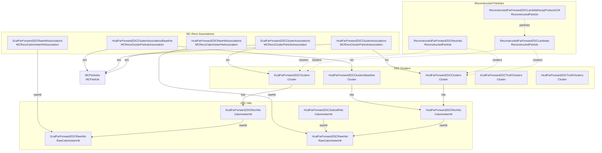

# EDM4EIC Lambda

EDM4EIC structures related to lambdas

```mermaid
graph TB
    %% Reconstructed Particles
    subgraph "Reconstructed Particles"
        RFZDCLambdas[ReconstructedFarForwardZDCLambdas<br/>ReconstructedParticle]
        RFZDCLambdaDecay[ReconstructedFarForwardZDCLambdaDecayProductsCM<br/>ReconstructedParticle]
        RFZDCNeutrals[ReconstructedFarForwardZDCNeutrals<br/>ReconstructedParticle]
    end

    %% Clusters
    subgraph "ZDC Clusters"
        EcalZDCClusters[EcalFarForwardZDCClusters<br/>Cluster]
        HcalZDCClusters[HcalFarForwardZDCClusters<br/>Cluster]
        HcalZDCClustersBaseline[HcalFarForwardZDCClustersBaseline<br/>Cluster]
        EcalZDCTruthClusters[EcalFarForwardZDCTruthClusters<br/>Cluster]
        HcalZDCTruthClusters[HcalFarForwardZDCTruthClusters<br/>Cluster]
    end

    %% Hits
    subgraph "ZDC Hits"
        EcalZDCRecHits[EcalFarForwardZDCRecHits<br/>CalorimeterHit]
        HcalZDCRecHits[HcalFarForwardZDCRecHits<br/>CalorimeterHit]
        HcalZDCSubcellHits[HcalFarForwardZDCSubcellHits<br/>CalorimeterHit]
        EcalZDCRawHits[EcalFarForwardZDCRawHits<br/>RawCalorimeterHit]
        HcalZDCRawHits[HcalFarForwardZDCRawHits<br/>RawCalorimeterHit]
    end

    %% MC Associations
    subgraph "MC-Reco Associations"
        EcalZDCClusterAssoc[EcalFarForwardZDCClusterAssociations<br/>MCRecoClusterParticleAssociation]
        HcalZDCClusterAssoc[HcalFarForwardZDCClusterAssociations<br/>MCRecoClusterParticleAssociation]
        HcalZDCClusterAssocBaseline[HcalFarForwardZDCClusterAssociationsBaseline<br/>MCRecoClusterParticleAssociation]
        EcalZDCRawHitAssoc[EcalFarForwardZDCRawHitAssociations<br/>MCRecoCalorimeterHitAssociation]
        HcalZDCRawHitAssoc[HcalFarForwardZDCRawHitAssociations<br/>MCRecoCalorimeterHitAssociation]
    end

    %% MC Particles
    MCParticles[MCParticles<br/>MCParticle]

    %% Relationships
    RFZDCLambdas -.->|clusters| EcalZDCClusters
    RFZDCLambdas -.->|clusters| HcalZDCClusters
    RFZDCLambdaDecay -.->|particles| RFZDCLambdas
    RFZDCNeutrals -.->|clusters| EcalZDCClusters
    RFZDCNeutrals -.->|clusters| HcalZDCClusters

    EcalZDCClusters -->|hits| EcalZDCRecHits
    HcalZDCClusters -->|hits| HcalZDCRecHits
    HcalZDCClustersBaseline -->|hits| HcalZDCRecHits

    EcalZDCRecHits -->|rawHit| EcalZDCRawHits
    HcalZDCRecHits -->|rawHit| HcalZDCRawHits
    HcalZDCSubcellHits -->|rawHit| HcalZDCRawHits

    EcalZDCClusterAssoc -->|rec| EcalZDCClusters
    EcalZDCClusterAssoc -->|sim| MCParticles
    HcalZDCClusterAssoc -->|rec| HcalZDCClusters
    HcalZDCClusterAssoc -->|sim| MCParticles
    HcalZDCClusterAssocBaseline -->|rec| HcalZDCClustersBaseline
    HcalZDCClusterAssocBaseline -->|sim| MCParticles

    EcalZDCRawHitAssoc -->|rawHit| EcalZDCRawHits
    HcalZDCRawHitAssoc -->|rawHit| HcalZDCRawHits
```